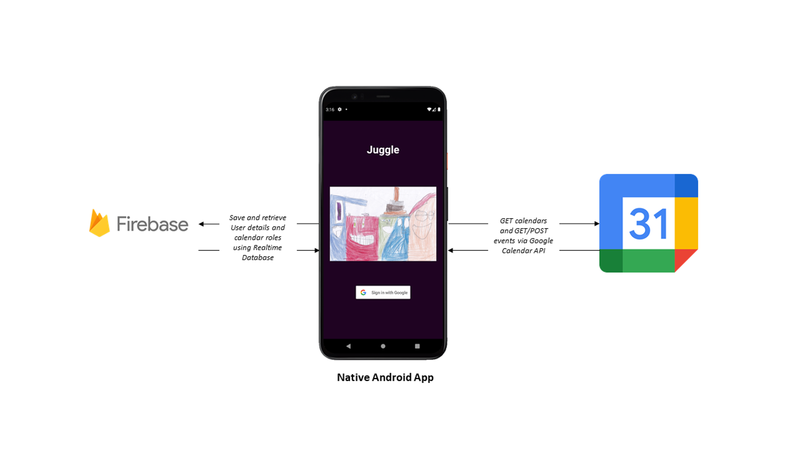

Inspired by the constant juggle of children’s activities and the assignment of related tasks for their parents.
Juggle is a native Android application that upon Google Sign-In retrieves and displays the calendars for which the user has owner access, the user can assign a Juggler(responsible adult) or Juggled(child) role to each calendar.
Juggled events can be viewed within the app and related events(getting there, getting home, other) added to one of the Jugglers calendars.
The app utilizes the Google calendar APIs and so the Android family can continue to use all the Google calendar event functionality.

 - Built using Kotlin
 - A User signs in using their existing Google account
 - A User grants permission to the app for read/write access to their Google calendar
 - User is authenticated with Firebase.
 - App gets calendar specifics using the Google calendar APIs, handles that data using custom built data models
 - App posts event specifics using the Google calendar APIs and again handle those responses
 - App saves to a Firebase Realtime database, a combination of data as retrieved using those APIs and data entered by the User, as well as retrieve data from that database.
 - App can display data sourced from all of the above (Google Sign In, Firebase Authentication, Google calendar APIs and Firebase Realtime database) and move it through the app and display to the User.

### Project Links
- [FINAL REPORT](KathleenMcCarthyKelleher_20042361_FinalReport.pdf)  
- [Demo video](https://youtu.be/Zm30F79KrHc)  
- [Trello board](https://trello.com/b/ggPVPCOG/juggle)  

